# 认识Uns-Link

## 操练场

操练场可以与AI进行对话，还可以微调对话参数。
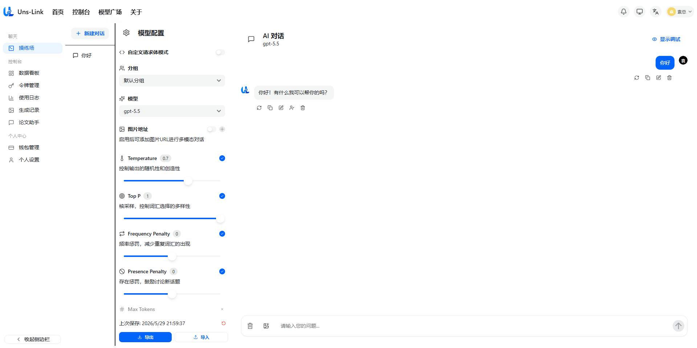

## 数据看板

数据看板记录了用户的各种数据，通过此页面可以快速了解使用情况。
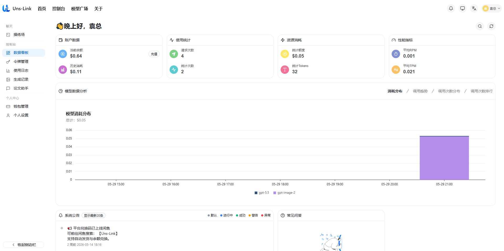

## 令牌管理

此页面可以创建并管理自己的AI密钥。
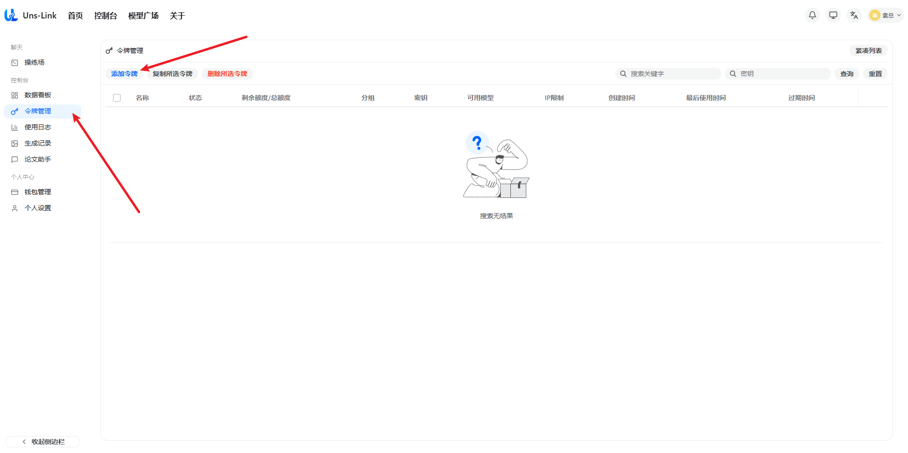
点击添加令牌后，输入名称并提交后，就完成了简单的密钥创建。
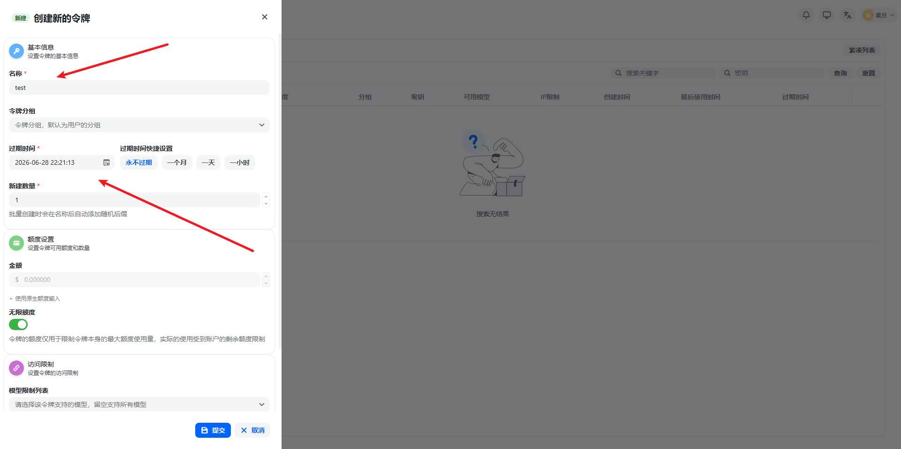
创建之后可以，在此界面进行复制密钥、禁用启用密钥、删除密钥等操作。

## 使用日志

此界面可以详细地看到AI使用记录
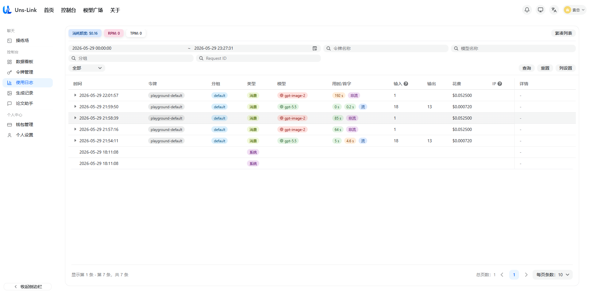

## 生成记录

此界面可以看到生产的图片
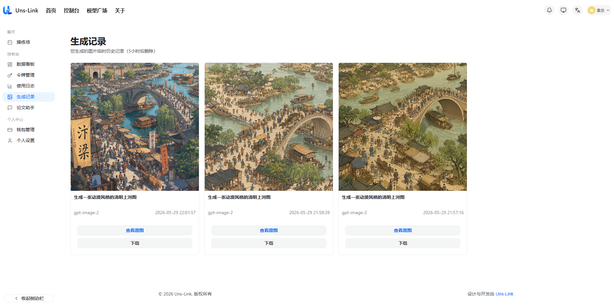

## 论文助手

此界面可以利用AI生成论文大纲、章节，还可以对论文进行降重，并生成答辩预测。
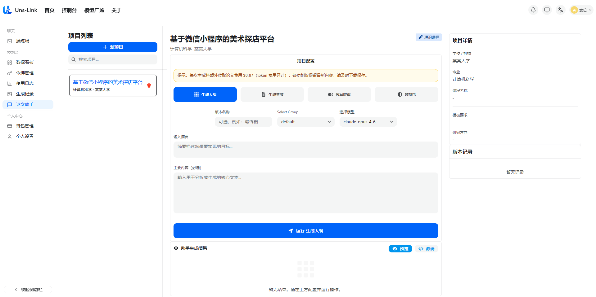

## AI PPT生成器

此界面可以利用AI生成ppt，依次填入
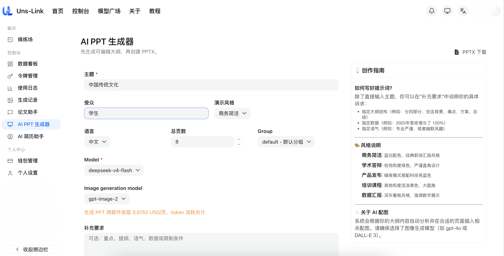
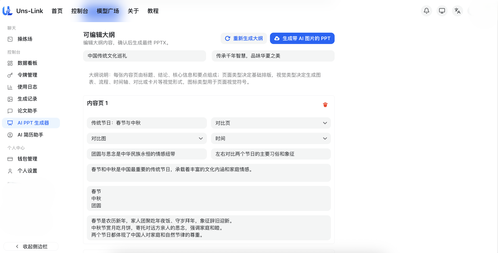
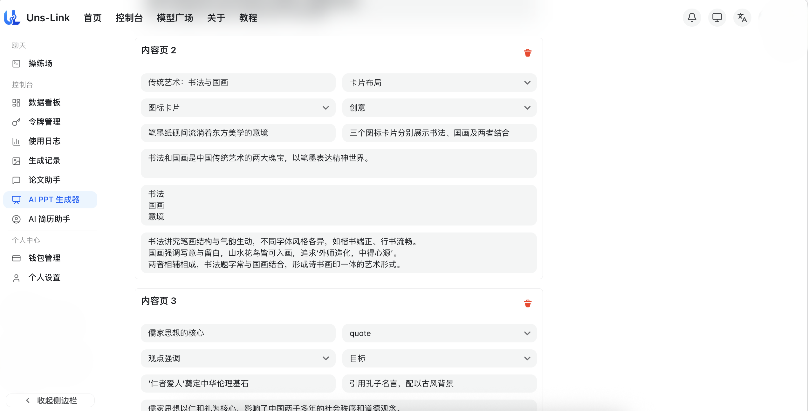

## AI简历助手

此界面可以利用AI生成、优化简历。填入简历的基础信息后。
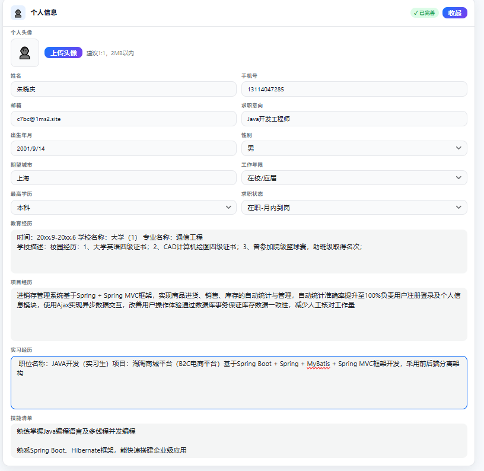
再将需要面试的岗位和岗位需求填入，点击生成简历。
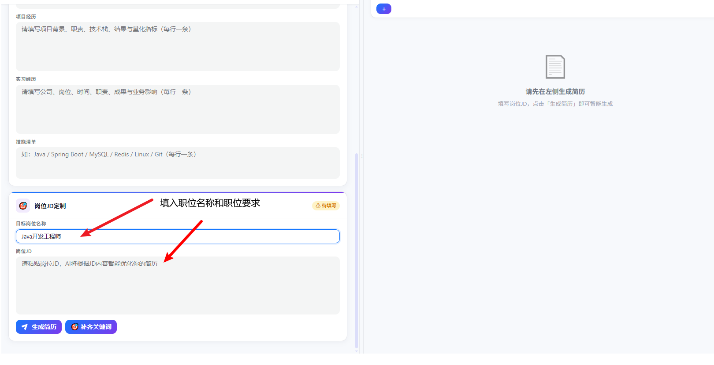
生成之后，还可以对具体的模块进行修改。
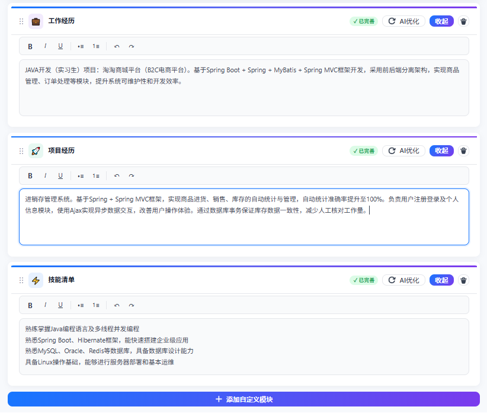
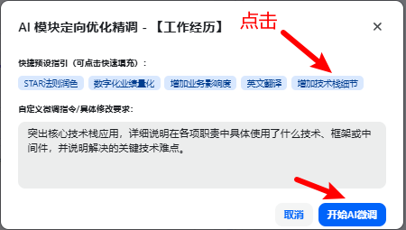
修改完后，可以调整排版，或者导出为Word或PDF。
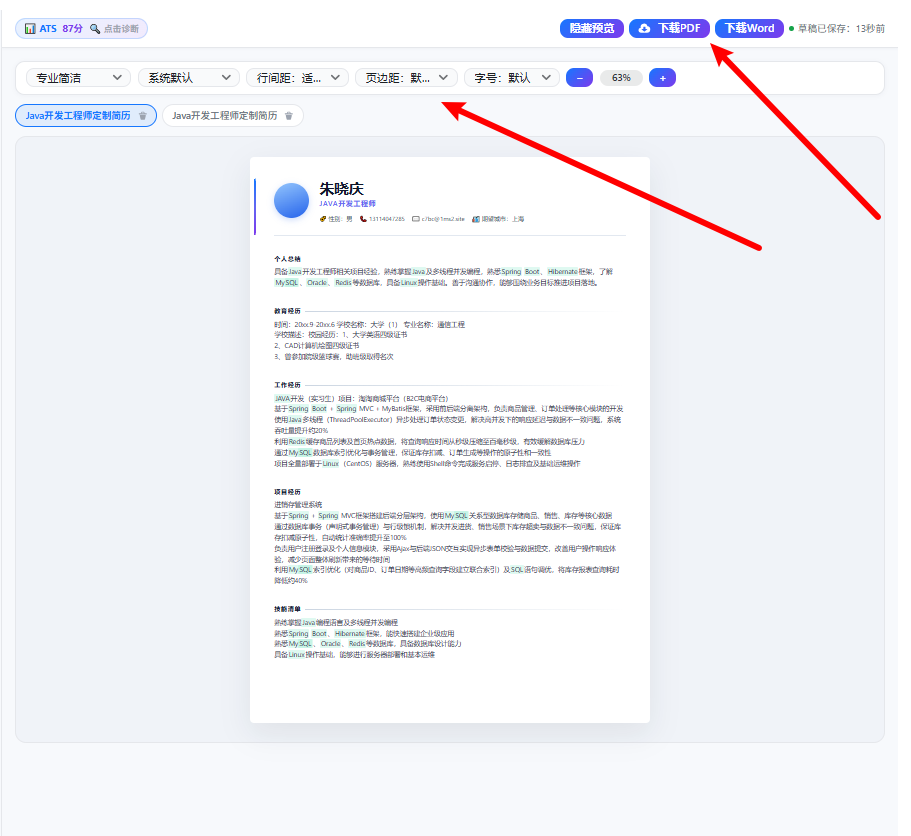

## 钱包管理

此界面可以充值和查看邀请奖励。
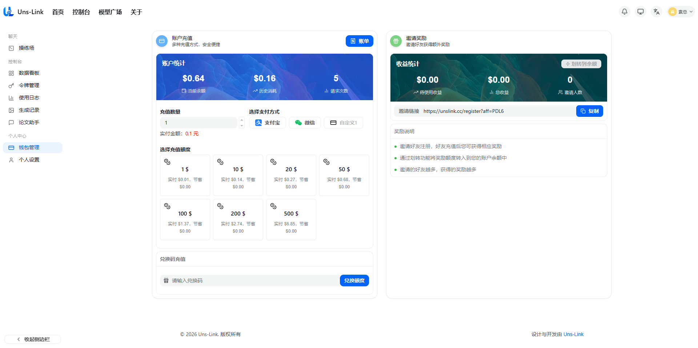

## 个人设置

此界面可以修改账户设置。
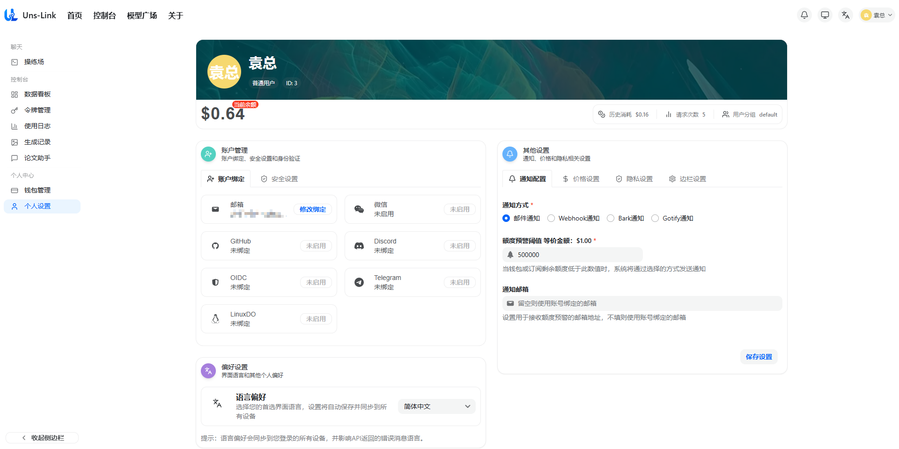

## 模型广场

模型广场界面展示了Uns-Link提供的所有模型，并且提供筛选功能，用户可以获取到模型的信息、价格、倍率以及调整计量单位等。
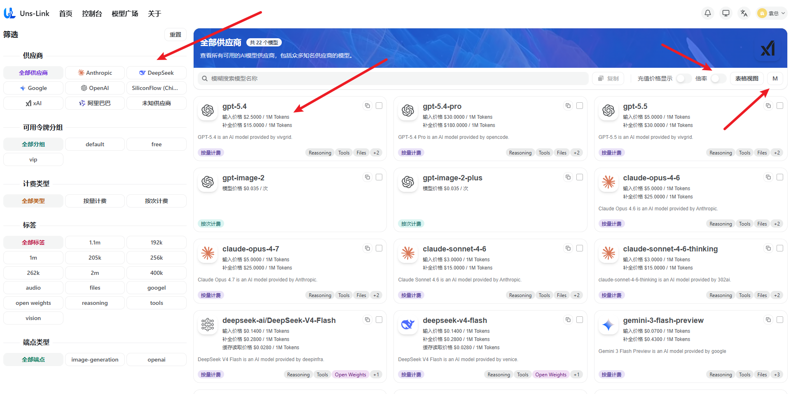
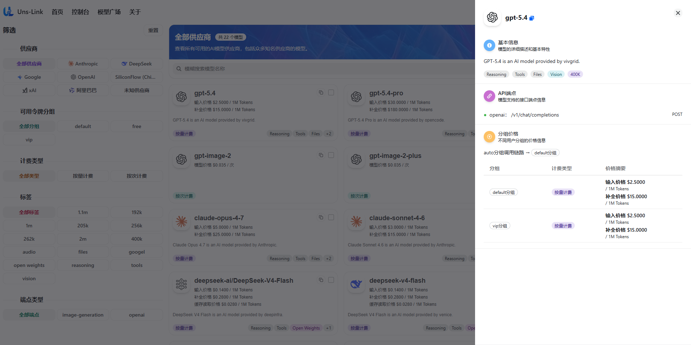

