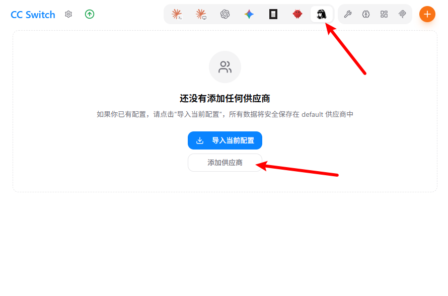
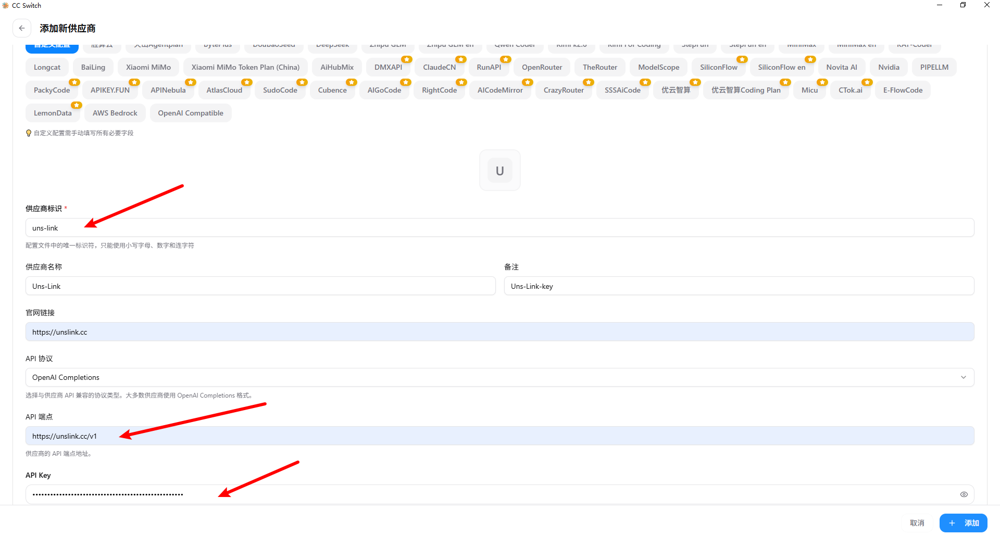
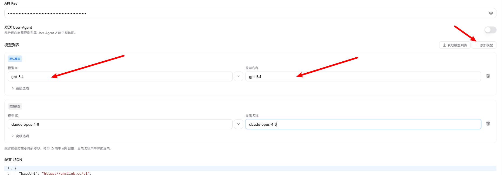
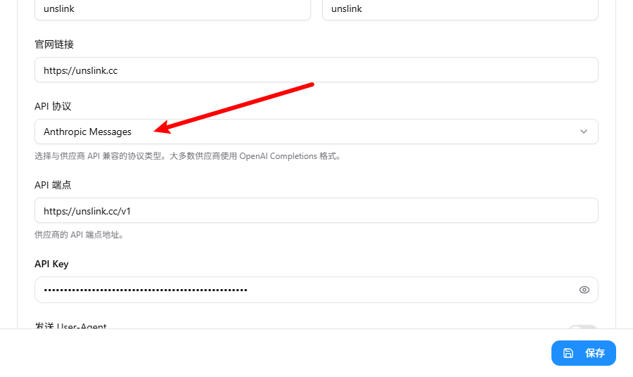
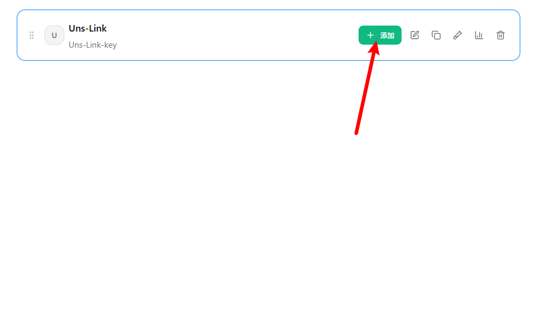
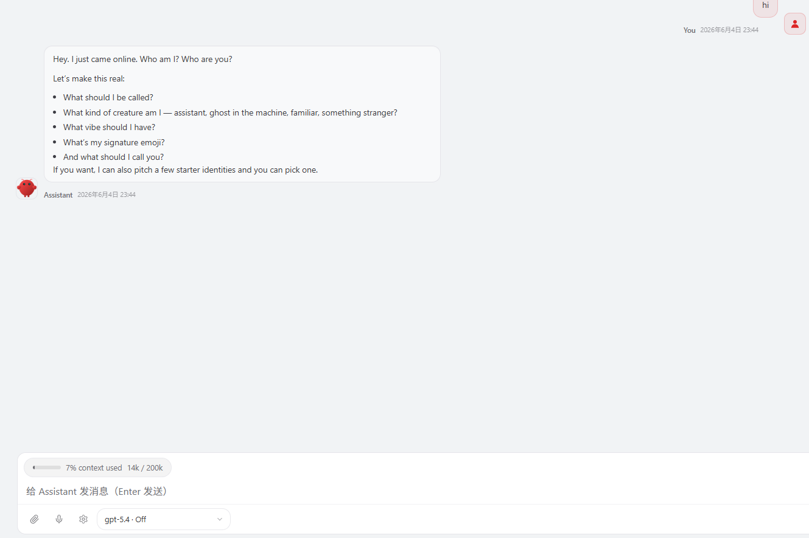

# 如何在Hermes中使用Uns-Link key

开源、自托管的AI AGENT。
Hermes Agent可以运行在本地电脑、VPS、Docker、SSH或云端开发环境中，不依赖单一IDE，也不把你的工作流锁在网页聊天框里。

官网：[OpenCode](https://opencode.ai/zh)

## 下载地址

#### 💻 Windows (PowerShell)

1. **管理员运行** PowerShell。
2. ​**安装 Hermes**​：`irm https://raw.githubusercontent.com/NousResearch/hermes-agent/main/scripts/install.ps1 | iex`。
3. ​**初始化**​：运行 `openclaw onboard`，按提示选择模式（推荐 QuickStart）并打开 WebUI。

#### 🍎 macOS 和🐧 Linux

1. ​**安装 Hermes**​：`curl -fsSL https://raw.githubusercontent.com/NousResearch/hermes-agent/main/scripts/install.sh | bash`。
2. ​**初始化**​：运行 `openclaw onboard`，按提示选择模式（推荐 QuickStart）并打开 WebUI。

## 使用说明

在令牌管理界面创建令牌后，复制apikey。

注意：如果要使用claude、gemini、grok，以及更快速的gpt模型需要切换成vip分组。同理需要使用低价模型可以切换分组为free分组，如果不切换默认使用default的分组，此分组只能使用部分性能较差的模型。

### 方法一：使用cc-switch

运行cc-switch，选择openclaw，点击添加供应商。

依次填入信息`https://unslink.cc/v1`

注意：需要使用claude模型需要将api协议调整为Anthropic Messages。

保存之后点击添加，即可开始在openclaw里对话。

注意：openclaw极其烧token，推荐使用便宜的模型，不要使用太贵的。

