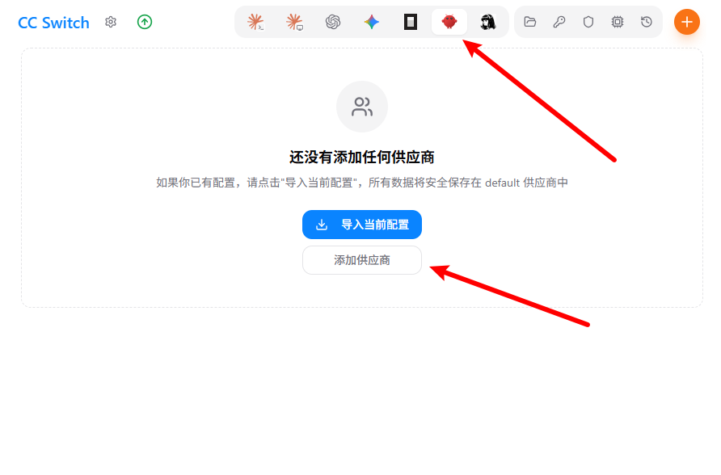

# 如何在OpenClaw中使用Uns-Link key

OpenClaw是一个开源的AI自动化代理，可本地部署以执行文件操作、浏览器自动化等任务。

官网：[OpenCode](https://openclaw.ai/)
cc-switch下载地址：[github]([https://openclaw.ai/](https://github.com/farion1231/cc-switch/releases/download/v3.16.1/CC-Switch-v3.16.1-Windows-Portable.zip))

## 下载地址

#### 💻 Windows (PowerShell)

1. **管理员运行** PowerShell。
2. ​**一键安装依赖**​：使用 `winget install OpenJS.NodeJS.LTS` 和 `winget install Git.Git`。
3. ​**配置镜像**​：`npm config set registry https://registry.npmmirror.com`。
4. ​**安装 OpenClaw**​：`npm install -g openclaw@latest`。
5. ​**初始化**​：运行 `openclaw onboard`，按提示选择模式（推荐 QuickStart）并打开 WebUI。
6. ​**管理命令**​：`openclaw gateway start` (启动), `openclaw status` (状态), `openclaw doctor` (健康检查)。

#### 🍎 macOS (终端)

1. ​**安装 Homebrew**​（若未安装）。
2. ​**安装依赖**​：`brew install node@24 git`。
3. ​**配置镜像与安装**​：同上，使用 `npm install -g openclaw@latest`。
4. ​**初始化与管理**​：同样运行 `openclaw onboard` 启动向导。
5. ​**配置文件路径**​：`~/.openclaw/openclaw.json`。

#### 🐧 Linux (Ubuntu/Debian)

1. ​**更新系统**​：`sudo apt update && sudo apt upgrade -y`。
2. ​**安装 Node.js**​：通过 nodesource 脚本安装 22.x 版本。
3. ​**安装 OpenClaw**​：需使用 `sudo npm install -g openclaw@latest`。
4. ​**开机自启**​：运行 `openclaw gateway enable`。
5. ​**配置文件路径**​：`~/.openclaw/openclaw.json`。

## 使用说明

在令牌管理界面创建令牌后，复制apikey。

注意：如果要使用claude、gemini、grok，以及更快速的gpt模型需要切换成vip分组。同理需要使用低价模型可以切换分组为free分组，如果不切换默认使用default的分组，此分组只能使用部分性能较差的模型。

### 方法一：使用cc-switch

运行cc-switch，选择openclaw，点击添加供应商。

依次填入信息`https://unslink.cc/v1`

注意：需要使用claude模型需要将api协议调整为Anthropic Messages。

保存之后点击添加，即可开始在openclaw里对话。

注意：openclaw极其烧token，推荐使用便宜的模型，不要使用太贵的。

