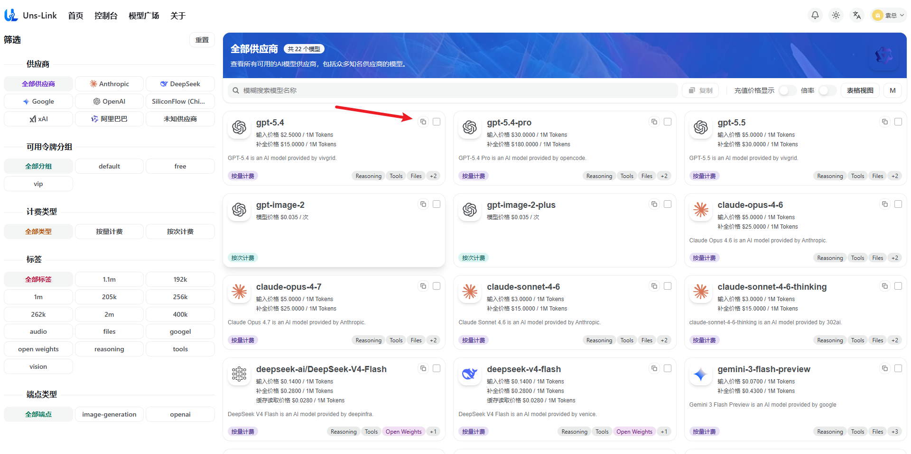
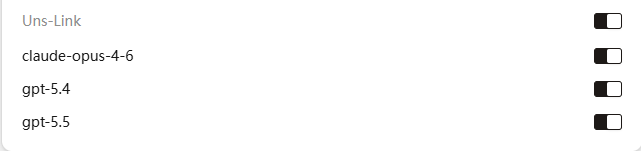
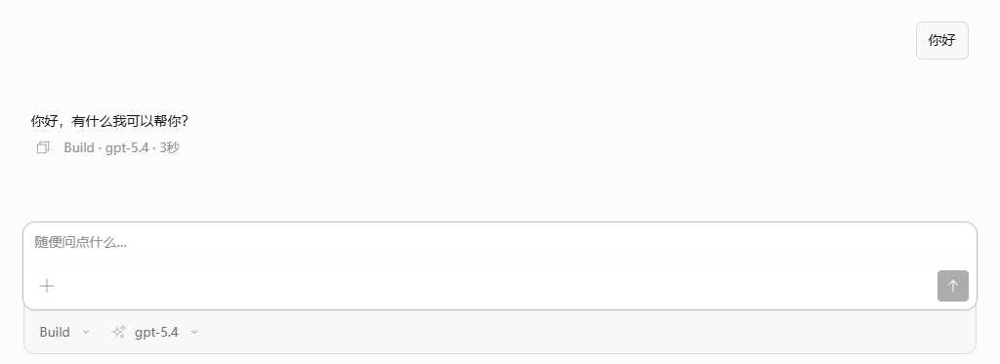

# 如何在OpenCode中使用Uns-Link key

OpenCode 是一个开源代理，帮助您使用任意 AI 模型编写和运行代码。它提供终端界面、桌面应用及 IDE 扩展。

官网：[OpenCode](https://opencode.ai/zh)

## 下载地址

- [macOS 下载](https://opencode.ai/zh/download/stable/darwin-aarch64-dmg)
- [Windows 下载](https://opencode.ai/zh/download/stable/windows-x64-nsis)
- [Linux 下载](https://opencode.ai/zh/download/stable/linux-x64-deb)
- 终端安装：`npm i -g opencode-ai` 或 `curl -fsSL https://opencode.ai/install | bash`

## 使用说明

1.在令牌管理界面创建令牌后，复制apikey。

2. 找到 OpenCode 的配置文件 `opencode.json` 或 `opencode.jsonc`。
常见路径如下：
`~/.config/opencode/opencode.json`（Linux/macOS）
`用户名\.config\opencode\opencode.json`（Windows）
如果文件或文件夹不存在，请手动创建，然后粘贴下方代码，并将 `apikey` 替换为你自己的密钥。

```yaml
{
  "$schema": "https://opencode.ai/config.json",
  "disabled_providers": [],
  "provider": {
    "Uns-Link": {
      "options": {
        "baseURL": "https://unslink.cc/v1",
        "apiKey": "sk-xxx"
      },
      "npm": "@ai-sdk/openai-compatible",
      "models": {
        "gpt-5.4": {
          "name": "gpt-5.4"
        }
      }
    }
  }
}
```

3.进入模型广场选择模型，复制其他想使用的模型名字，添加到代码中。


```yaml
{
  "$schema": "https://opencode.ai/config.json",
  "disabled_providers": [],
  "provider": {
    "Uns-Link": {
      "options": {
        "baseURL": "https://unslink.cc/v1",
        "apiKey": "sk-xxx"
      },
      "npm": "@ai-sdk/openai-compatible",
      "models": {
        "gpt-5.4": {
          "name": "gpt-5.4"
        },
        "gpt-5.5": {
          "name": "gpt-5.5"
        },
        "claude-opus-4-6": {
          "name": "claude-opus-4-6"
        }
    }
  }
}
```

4.保存后重新打开opencode，既可开始使用AI。




