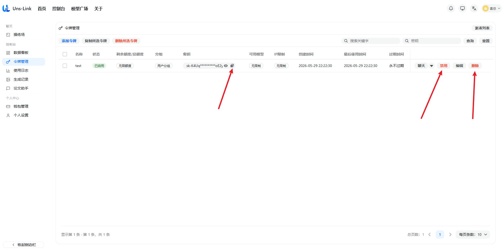
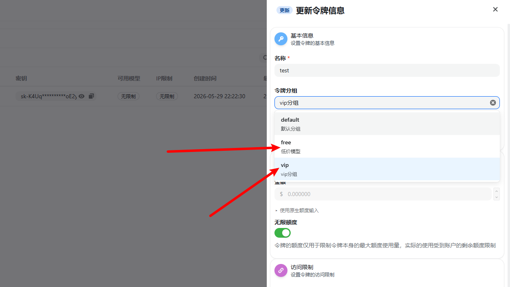
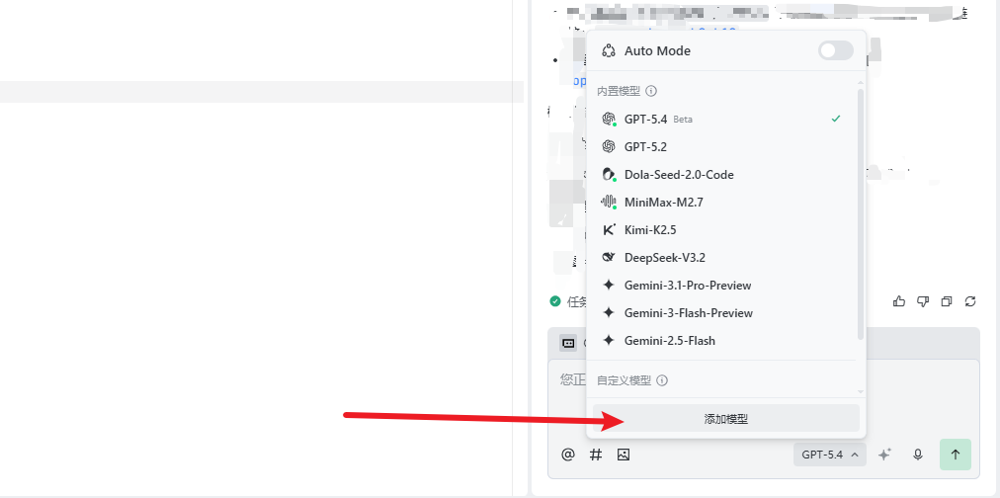
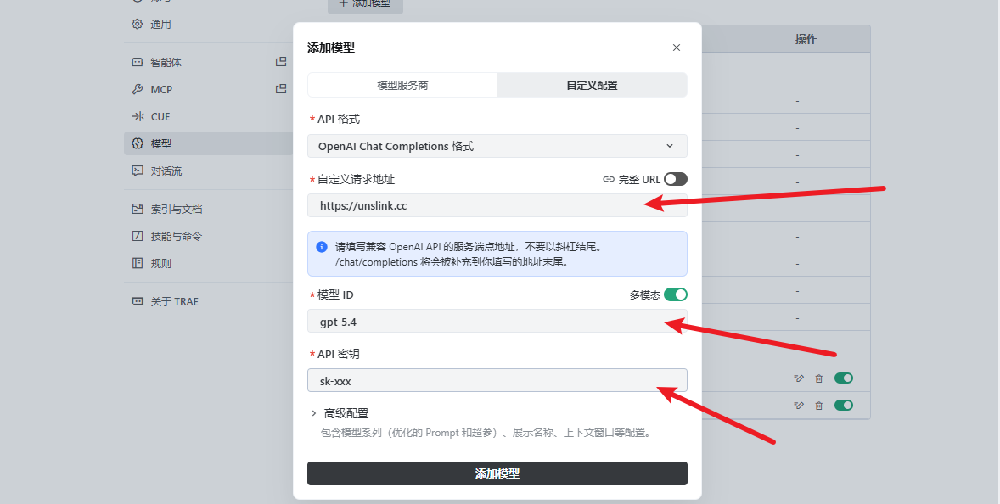
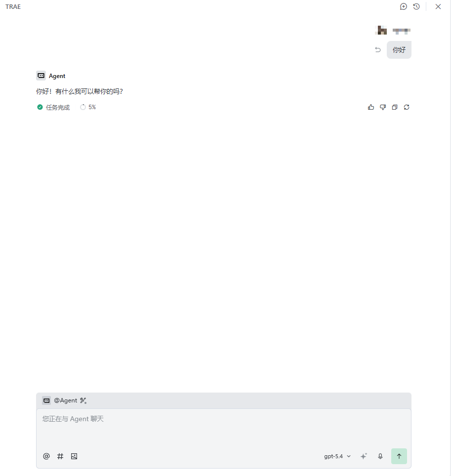

# 如何在Trae中使用Uns-Link key

TRAE IDE 是一款深度融合 AI 能力的开发工具，提供从代码编写、项目理解、调试运行到变更管理的完整开发体验。你可以像使用传统 IDE 一样掌控每一步，也可以把复杂任务交给 AI 智能体规划和执行。

官网：[Trae](https://trae.ai/)

## 下载地址

- [macOS 下载](https://lf-cdn.trae.ai/obj/trae-ai-sg/pkg/app/releases/stable/2.3.30128/darwin/Trae-darwin-arm64.dmg)
- [Windows 下载](https://lf-cdn.trae.ai/obj/trae-ai-sg/pkg/app/releases/stable/2.3.30128/win32/Trae-Setup-x64.exe)
- [Linux 下载](https://lf-cdn.trae.ai/obj/trae-ai-sg/pkg/app/releases/stable/2.3.30128/linux/Trae-linux-x64.deb)

## 使用说明

1.在令牌管理界面创建令牌后，复制apikey。

注意：如果要使用claude、gemini、grok，以及更快速的gpt模型需要切换成vip分组。同理需要使用低价模型可以切换分组为free分组，如果不切换默认使用default的分组，此分组只能使用部分性能较差的模型。

2.从右下角点击添加模型。

3.选择自定义模型后，依次填入请求地址`https://unslink.cc/v1`、模型ID（在模型广场复制）、apikey。

4.保存后选择相应AI，既可开始使用。

